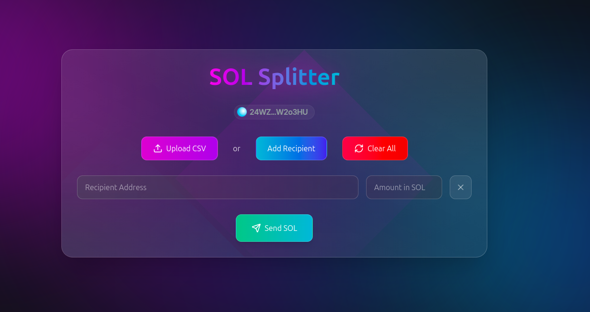

# SOL Splitter

SOL Splitter is a Solana-based web application designed to make it easy to send SOL tokens to multiple wallets. It supports both manual recipient entry and CSV file uploads for batch processing. This app is perfect for simplifying bulk transactions.

---

## Features

- **Manual Entry**: Add recipients one by one by entering their wallet addresses and the amount of SOL to send.
- **CSV Upload**: Upload a CSV file containing recipient wallet addresses and amounts for batch transactions.
- **Clear All**: Reset all entered or uploaded data with a single click.
- **User-Friendly UI**: Clean and intuitive interface for smooth user experience.

---

## How It Works

1. **Connect Wallet**: Ensure your Solana wallet is connected.
2. **Add Recipients**:
   - **Manually**: Enter recipient wallet addresses and corresponding amounts in SOL.
   - **Via CSV**: Upload a properly formatted CSV file (`recipient_address,amount_in_SOL`).
3. **Send SOL**: Click the "Send SOL" button to initiate the transfer.
4. **Clear All**: Remove all entered or uploaded data if needed.

---

## CSV File Format

The uploaded CSV file should follow this structure:

```csv
recipient_address,amount_in_SOL
ADDRESS_1,AMOUNT_1
ADDRESS_2,AMOUNT_2
ADDRESS_3,AMOUNT_3
```

**Example**:
```csv
recipient_address,amount_in_SOL
9xBC2W9wDkW...,0.5
5Zc8W9xGJ1K...,1.2
3VrWQ6FpD7R...,0.3
```

---

## Installation and Setup

1. Clone the repository:
   ```bash
   git clone https://github.com/iamnas/sol-splitter.git
   cd sol-splitter
   ```

2. Install dependencies:
   ```bash
   npm install
   ```

3. Run the app:
   ```bash
   npm start
   ```

4. Open the app in your browser:
   ```
   http://localhost:3000
   ```

---

## Usage

1. **Connect your wallet**.
2. Enter recipient details manually or upload a CSV file.
3. Review the recipient list and amounts.
4. Click the "Send SOL" button to initiate the transaction.
5. Monitor your wallet for transaction confirmation.

---

## Technologies Used

- **React.js**: Frontend framework.
- **Tailwind CSS**: For styling the UI.
- **Solana Web3.js**: To interact with the Solana blockchain.
- **Node.js**: Backend services.

---

## Screenshot



---

## Contributing

Contributions are welcome! If you'd like to improve the app, please fork the repository and submit a pull request.

---

## License

This project is licensed under the MIT License. See the [LICENSE](./LICENSE) file for details.

---